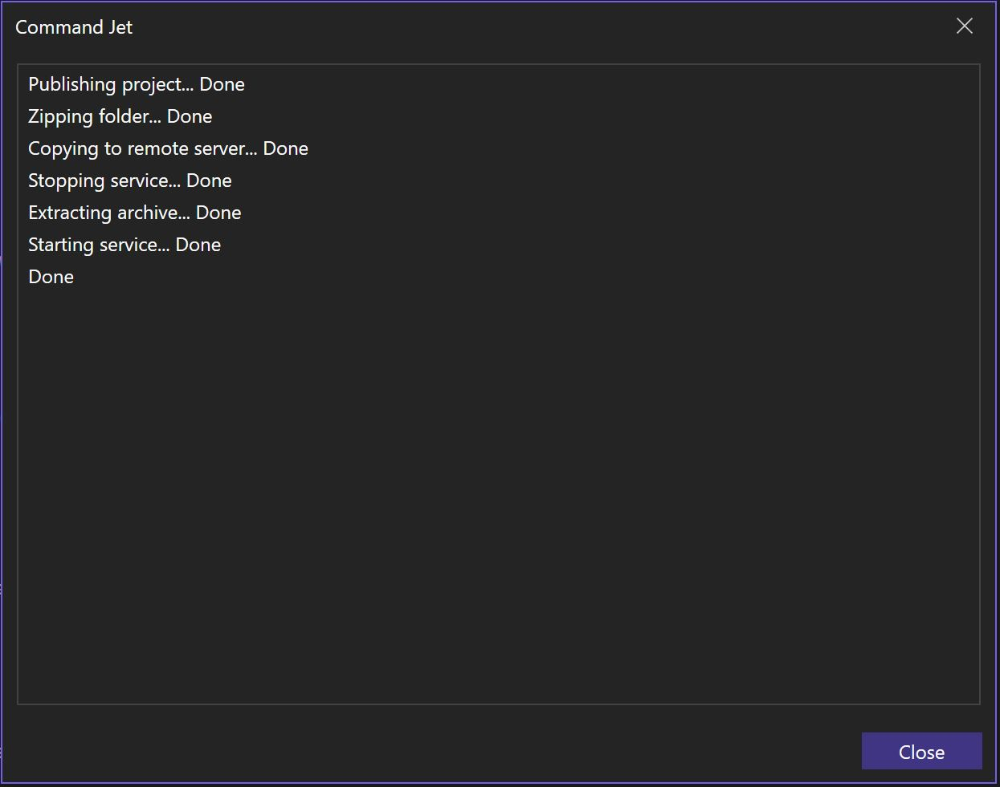

# Command Jet

Download this extension from the VS marketplace [Visual Studio 2022 (17.10)](https://marketplace.visualstudio.com/items?itemName=BehrouzRad.CommandJet) 

This extension is based on [VisualStudio.Extensibility (Preview)](https://learn.microsoft.com/en-us/visualstudio/extensibility/visualstudio.extensibility/visualstudio-extensibility?view=vs-2022) which is a new framework for developing Visual Studio extensions that focuses primarily on extensions that run out-of-process from the IDE for improved performance and reliability. 

I created this extension both to experiment with the new framework and to provide a visual way to run commands within Visual Studio.

The commands can be either local or remote. Remote commands are designed to be executed based on the SSH protocol. To run remote commands, you need a key. The path to this key can be set in the settings file as the value of `PrivateKeyPath`.

To use the extension, place `commandjet.settings.json` in the root directory of the main project and write the commands. You can find a sample of commands [here](https://github.com/behrouz-rad/commandjet/blob/main/src/CommandJet/Resources/commandjet.settings.json).
Select `Command Jet` from the `Extensions` menu. The progress will be displayed in a dialog similar to this:

### Note
- The working directory for the commands is the root path of the main project.
- Ensure that SSH is [properly](https://learn.microsoft.com/en-us/windows-server/administration/openssh/openssh_keymanagement) configured on the remote server and that the `ssh-agent` service is running before executing remote commands.
- Currently two custom SSH commands are supported: `copy-file-ssh` and `copy-folder-ssh`.
